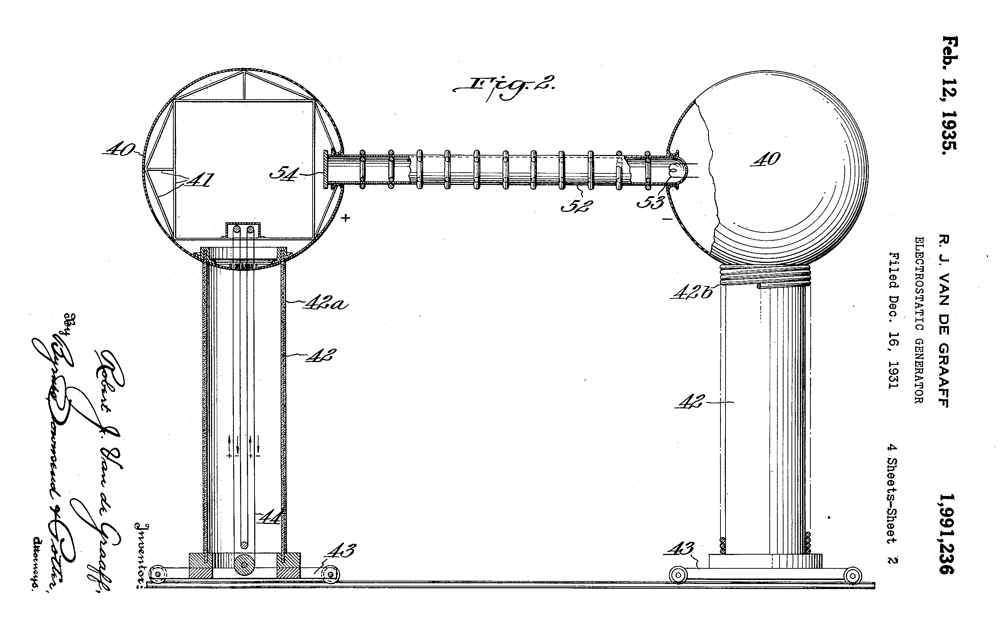
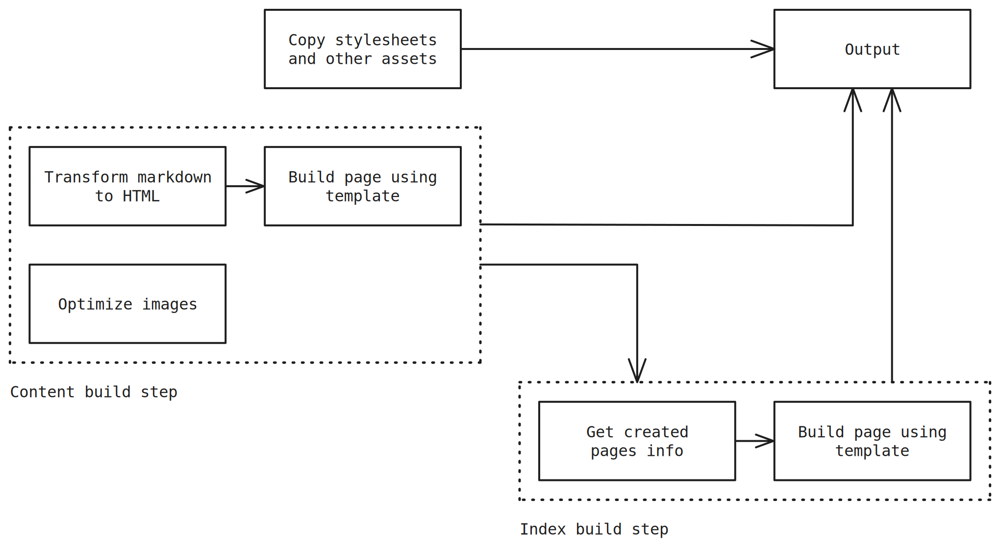
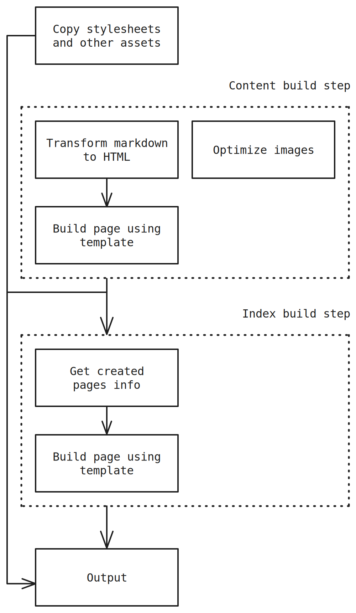

# Colophon

This website is generated using [miu](https://github.com/jpesce/miu), a very simple static site
generator written from the ground up. This page serves as a high-level documentation of how the
generator works and the thoughts that went in when creating it. It was written in hopes that it
might be useful for someone attempting to or already building one such program. It was also written
for myself as a [way of reflecting about 
it](https://www.goodreads.com/quotes/320581-writing-is-thinking-to-write-well-is-to-think-clearly)
and to serve as an assistant for future iterations.

## Why build a site generator?

1. Learn a (new) programming language. In my case I wanted to see what [Go](https://go.dev/) looked
   like, so it seemed like a fun thing to do.
2. Explore the core elements of developing a website. Some would argue that today’s popular ways of
   building websites are just [too damn
   complex](https://frankchimero.com/blog/2018/everything-easy/) and I have a hunch that some
   developers have no idea what's going on behind the curtains a lot of the times. By creating your
   own tools, you are able to gain an clearer understanding of the process and possibly cultivate
   both an appreciation and criticism for other tool chains.
3. Don't go full bare-bones. Maintaining a moderately complex website in pure HTML/CSS may prove to
   be a suicidal task.

## Naming

miu is both a Japanese given name (美宇) and a
[pronunciation](https://dictionary.cambridge.org/pronunciation/english/mu) for the greek letter μ.
The letter μ is used as a unit prefix denoting a factor of 10−6 (one millionth) or, in
other words, it's very tiny. It's also the coefficient of friction, which is the principle by which
some (electro)static generator machines work, so it fits the theme of static (site) generators
nicely. I guess a loose translation could be “a very tiny thing that generates static stuff”.

## Modules

Here's a high-level overview of the different modules that comprise the generator:

| Module | What it does | Simpler alternative | Implementation in miu |
| --- | --- | --- | --- |
| Template engine | Combine templates and sometimes also data to produce pages | Copy and paste code and data | [Go's standard library](https://pkg.go.dev/html/template) |
| Markdown renderer | Transform markdown (which is more succinct) to HTML | Write everything directly in HTML | [Pandoc](https://pandoc.org/) |
| Image processor | Optimize image sizes, process images in a desired way | Optimize images manually | [ImageMagick](https://imagemagick.org/index.php) and [cwebp](https://developers.google.com/speed/webp/docs/cwebp) |
| Cache | Speed up the build process by rebuilding only what's been changed | Wait longer | Custom module |
| Build pipeline | Execute the modules in the right order, to the right files and output to the right places | Execute modules and move files around manually | Custom module |

## High-level understanding

In miu, content is stored as plain-text markdown files aiming for easy migration and enhanced
longevity. Templates provide both a way to reuse sections such as the header and a way to generate
special pages such as the index. The build pipeline orchestrate things acting like the controller in
the [modern understanding of the MVC architecture](https://wiki.c2.com/?WhatsaControllerAnyway).

{.desktop-only}

{.mobile-only}

Step by step:

1. Assets such as style sheets, favicons and global images are copied directly
2. Markdown content is compiled to HTML and placed in their templates
3. Markdown images are optimized
4. Index is generated based on the content that was previously built

## FAQ

If it's so simple, why not go even more bare-bones and do it as bash scripts?
: I've done that in a project innocently named [shite](https://github.com/jpesce/shite/) (shell +
site) and it was fun! I enjoyed a lot but felt I wasn't fluent enough in the language. Making simple
things that would be trivial in other programming languages felt like a struggle. But I'd love to
tackle that again some day.

What if I don't want to create my own generator?
: There are great projects out there such as [Jekyll (Ruby)](https://jekyllrb.com/), [Hugo
(Go)](https://gohugo.io/), [11ty (Javascript)](https://www.11ty.dev/), [Pelican
(Python)](https://getpelican.com/).

How do people usually do this?
: Every site is different – and that's the beauty of it. Here are some interesting approaches other
people have taken: [qubyte](https://qubyte.codes/colophon) has a great philosophy of keeping things
simple; [Devine Lu Linvega](https://wiki.xxiivv.com/site/about.html)'s site is highly aligned with
the way they build software; [IndieWeb's colophon](https://indieweb.org/colophon) page is also a
great resource for everything colophon.
